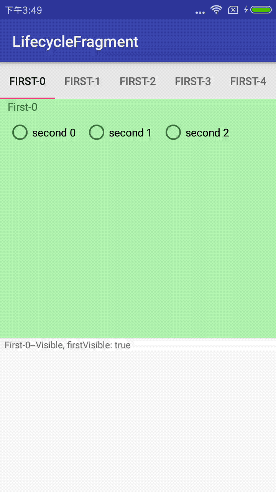

# LifecycleFragment

[  ](https://bintray.com/angeldevil/Maven/LifecycleFragment/_latestVersion)

A library to simplify fragment's lifecycle to onVisible &amp; onInvisible



Setup
========

```
allprojects {
  repositories {
    jcenter()
  }
}
```

```
dependencies {
  compile 'me.angeldevil:LifecycleFragment:1.0'
}
```

Usage
========

```java
public class DebugFragment extends LifecycleFragment {

    @CallSuper
    @Override
    protected void onInvisible() {
        Log.d("TAG", "I'm invisible")
    }

    @CallSuper
    @Override
    protected void onVisible(boolean firstVisible) {
        Log.d("TAG", "I'm visible")
    }
}
```

Licence
=========

Copyright 2018 angeldevil.me

Licensed under the Apache License, Version 2.0 (the "License");
you may not use this file except in compliance with the License.
You may obtain a copy of the License at

   http://www.apache.org/licenses/LICENSE-2.0

Unless required by applicable law or agreed to in writing, software
distributed under the License is distributed on an "AS IS" BASIS,
WITHOUT WARRANTIES OR CONDITIONS OF ANY KIND, either express or implied.
See the License for the specific language governing permissions and
limitations under the License.
